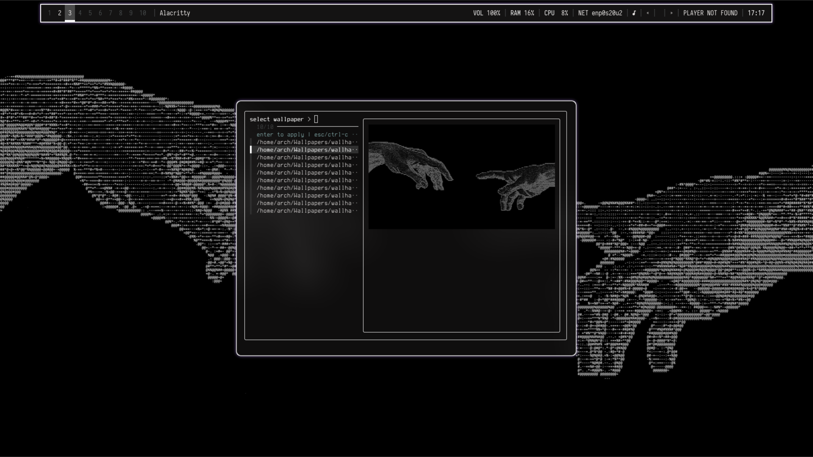
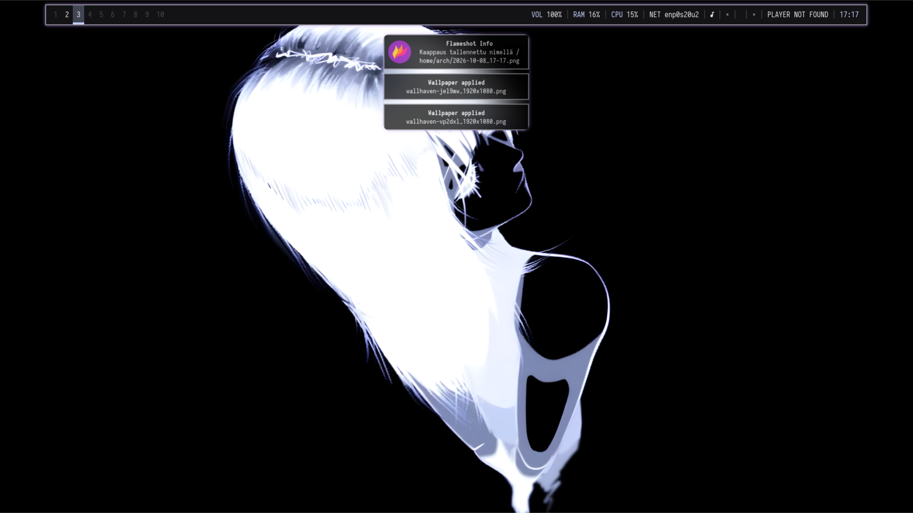
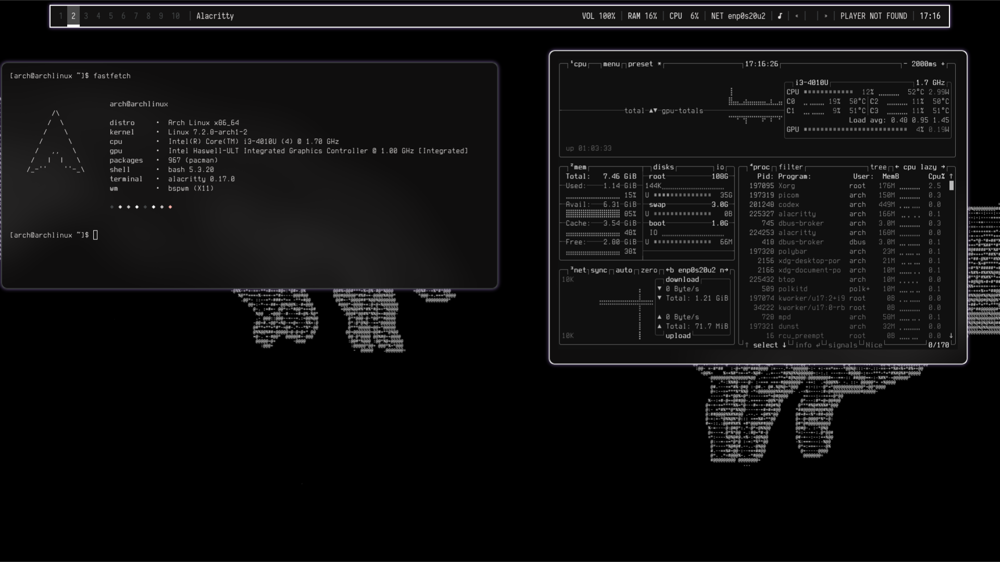

# Synx Shell

Synx Shell is a keyboard-driven X11 desktop shell built around bspwm. It brings
together window management, a Polybar status bar, Rofi launchers, notifications,
clipboard tools, and wallpaper-based color themes in one installable setup.

The installer configures the shell and keeps its managed files in a stable
checkout at `~/.local/share/synx-shell/repo` for updates and deployment.

> **Beta:** Synx Shell is under active development. Expect configuration and
> installer changes between releases.

## Compatibility and test status

Arch Linux is the only distribution tested so far, on a single monitor. Debian/Ubuntu, Fedora,
openSUSE, Void Linux, and Alpine Linux are untested; package availability and
desktop integration may differ on those systems. Picom 12 or newer is required
for the bundled window-rule syntax.

The tested machine is an Intel NUC with a Core i3-4010U, integrated Intel HD
Graphics 4400, and 8 GB of RAM (7.46 GiB available to Linux). In the included
desktop snapshot, btop reports 1.14 GiB used and 6.31 GiB available.


## Screenshots

### Wallpaper picker



### Desktop





## Install

Install Synx Shell directly from its public GitHub repository:

```sh
bash -c "$(curl -fsSL https://raw.githubusercontent.com/L1mppa/Synx-Shell/v0.1.6/install/install.sh)"
```

The installer downloads the public source archive without requiring a GitHub
token. It stages downloads before replacing the stable checkout, then presents
settings, dependencies, wallpaper copy, and deployment steps. Re-running it
installs the same pinned release again. To install another tagged release, set
`SYNX_SHELL_TAG` before running the bootstrap script. Before preparing a release,
run `bash scripts/release.sh vMAJOR.MINOR.PATCH` to update both version pins,
then commit the change and create and publish the matching Git tag.
Existing user configuration is backed up under
`~/.local/state/synx-shell/backups/` when it is first replaced.

On Arch Linux, the dependency step uses `yay` or `paru` for AUR packages. It
builds `yay` if neither helper is installed and stops with a clear message if
that build fails. The Arch package step runs a full `pacman -Syu` transaction,
so it may upgrade existing system packages; review and confirm pacman's
transaction.
It installs an X server, `xinit`, Iosevka Nerd Font Mono, and Terminess Nerd
Font Mono. Noto CJK fonts are offered separately as an optional package because they are large. Pacman presents its normal transaction confirmation before installing packages. On Debian/Ubuntu and Fedora, packages install one at a time
so an unavailable package (such as Alacritty on an older release) is reported
and does not stop the rest. Nerd Font variants may need manual installation on
non-Arch systems, so some Polybar glyphs may be missing.
Polybar uses fontconfig fallback when a named Nerd Font is unavailable. The
optional Noto CJK font provides fallback glyphs for CJK media titles when installed.
Deployment includes an `~/.xinitrc` that starts bspwm, so after installing the
X server and xinit you can launch from a TTY with `startx`. The deployed
`.xinitrc` is executable and starts bspwm directly.

To restore a backed-up config, remove the deployed symlink or file and move its
backup from the matching path under `~/.local/state/synx-shell/backups/<timestamp>/`
back to its original location. Backups preserve paths such as
`.config/bspwm/bspwmrc`.

## Installer steps

1. Choose a locale, X11 keyboard layout, timezone, and a 12- or 24-hour clock
   from searchable, paged menus. Locale choices come from the system locale list
   and its supported-locale database; keyboard layouts use the installed XKB
   list, and timezones use `timedatectl` or the installed zoneinfo database.
   Search with `/text`, use `n` and `p` to page, and choose `0` to keep the
   current setting. The installer saves the selections in
   `~/.config/synx-shell/` and applies them to the Synx Shell session.
2. Install desktop and wallpaper-picker dependencies.
3. Copy supported repository wallpapers to `~/Wallpapers` (or
   `WALLFINDER_DIR`).
4. Deploy Synx Shell configuration.

## Wallpaper picker and colors

Launch the picker with **Super + W**. In an X11 terminal, `ueberzugpp` draws a
sharp image preview. If it is unavailable, `chafa` provides a terminal preview;
the picker works with either one. `feh` applies the wallpaper. Matugen is the
single dynamic color source: its palette updates bspwm borders, Polybar,
Rofi, Alacritty, and Dunst. Generated files live in
`~/.local/state/synx-shell/`, outside the linked checkout. Without Matugen, the
bundled neutral palette is used.

Explore the wallpaper collection and its source pages in
[wallpapers/CREDITS.md](wallpapers/CREDITS.md).
Each wallpaper retains its creator's own license and usage terms. Wallhaven
does not grant a shared license for the images.

## Credits and license

The wallpaper picker's concept and selector UI were inspired by
[gustahxn/Wallfinder](https://github.com/gustahxn/wallfinder). Synx Shell has
its own X11/bspwm implementation: feh applies wallpapers, ueberzugpp provides
sharp previews with chafa as a fallback, and Matugen updates the shell's
runtime color files and bspwm borders. The upstream project uses a separate
Wayland/swaybg implementation; Synx Shell's implementation is inspired by and partly modeled on its concept and selector UI.
See [NOTICE](NOTICE) for the upstream MIT license text and attribution.

Synx Shell is available under the [MIT License](LICENSE).

## Keybindings

The main modifier is **Super** (usually the Windows key).

### Launchers and actions

| Key | Action |
| --- | --- |
| `Super + Enter` | Open Alacritty |
| `Super + Space` | Open the Rofi app and window launcher |
| `Super + W` | Open the wallpaper picker |
| `Super + P` | Start Flameshot region capture |
| `Super + E` | Open Bemoji using Rofi, xclip, and xdotool |
| `Super + Shift + V` | Open the Greenclip clipboard menu |
| `Super + S` | Open the Rofi power menu |
| `Super + B` | Open Bluetooth controls |
| `Super + Esc` | Reload sxhkd keybindings |

### Window and desktop control

| Key | Action |
| --- | --- |
| `Super + Q` | Close the focused window |
| `Super + Shift + Q` | Kill the focused window |
| `Super + Alt + Q` | Quit bspwm |
| `Super + Alt + R` | Restart bspwm |
| `Super + T` | Set tiled state |
| `Super + Shift + T` | Set pseudo-tiled state |
| `Super + V` | Set floating state |
| `Super + F` | Set fullscreen state |
| `Super + M` | Toggle tiled and monocle layouts |
| `Super + G` | Swap the focused window with the largest window |
| `Super + Y` | Move the newest marked window to the newest preselected node |
| `Super + Ctrl + M/X/Y/Z` | Set the marked / locked / sticky / private flag |
| `Super + H/J/K/L` | Focus the window left / down / up / right |
| `Super + Shift + H/J/K/L` | Swap the focused window with its neighbor |
| `Super + C` | Focus the next window in this desktop |
| `Super + Shift + C` | Focus the previous window in this desktop |
| `Super + [` / `Super + ]` | Focus the previous / next desktop |
| `Super + Grave` | Focus the last window |
| `Super + Tab` | Focus the last desktop |
| `Super + O` / `Super + I` | Focus the older / newer window in focus history |
| `Super + 1…9` / `Super + 0` | Focus desktop 1…9 / desktop 10 |
| `Super + Shift + 1…9` / `Super + Shift + 0` | Send the focused window to desktop 1…9 / desktop 10 |

### Tiling and floating window movement

| Key | Action |
| --- | --- |
| `Super + Ctrl + H/J/K/L` | Preselect left / down / up / right for the next tiled window |
| `Super + Ctrl + 1…9` | Set the preselection ratio to 0.1…0.9 |
| `Super + Ctrl + Space` | Cancel the focused node's preselection |
| `Super + Ctrl + Shift + Space` | Cancel preselection for all windows on the desktop |
| `Super + Alt + H/J/K/L` | Expand the focused window left / down / up / right |
| `Super + Alt + Shift + H/J/K/L` | Contract the focused window from the left / bottom / top / right |
| `Super + Arrow keys` | Move a floating window |

## Components

- **Window management:** bspwm with sxhkd keyboard controls and guarded startup
- **Desktop tools:** Alacritty, Polybar, Rofi, Picom, and Dunst
- **Media and system info:** Polybar MPRIS controls and Fastfetch
- **Wallpaper themes:** `wallfinder` previews wallpapers and applies Matugen colors

The X11 Bemoji shortcut sets `BEMOJI_PICKER_CMD=rofi`,
`BEMOJI_CLIP_CMD=xclip`, and `BEMOJI_TYPE_CMD=xdotool`. This matches bemoji's
documented X11 tools; install `xclip` for clipboard copying and `xdotool` for
typing. Some optional shortcuts also use Flameshot, Greenclip,
`rofi-power-menu`, and `dmenu-bluetooth`. NetworkManager is an optional
network manager and may conflict with iwd or systemd-networkd. BlueZ is needed
for the optional Bluetooth shortcut; the installer does not enable
`bluetooth.service`.
